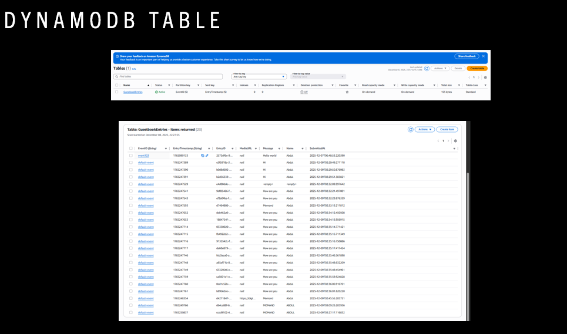
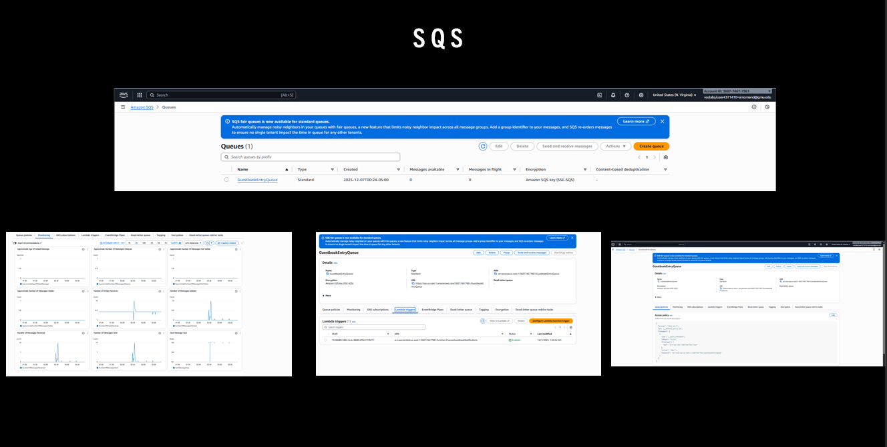

# AWS Serverless Digital Guestbook

## Overview
Designed and deployed a fully serverless cloud application using AWS services.
Users submit their name, message, and optional image through a REST API endpoint.

The backend processes requests using Lambda and stores data across DynamoDB and S3 while integrating asynchronous messaging through SQS.

## Architecture

## AWS Services Used
- API Gateway – REST API endpoint
- AWS Lambda – Serverless compute
- DynamoDB – NoSQL data storage
- S3 – Image object storage
- SQS – Asynchronous messaging queue
- SNS – Event notification (if implemented)
- CloudWatch – Logging & monitoring
- IAM – Role-based security

## System Workflow
1. User submits data via REST API.
2. API Gateway triggers Lambda.
3. Lambda:
   - Validates input
   - Stores guest entry in DynamoDB
   - Uploads image to S3
   - Sends event to SQS
4. CloudWatch logs monitor execution.

## Engineering Concepts Demonstrated
- Serverless Architecture
- Event-Driven Design
- Asynchronous Processing
- IAM Least Privilege
- Distributed Logging & Monitoring

## Screenshots

### API Gateway

### Lambda

### DynamoDB

### S3

### SQS

### Postman Testing

### CloudWatch Logs

